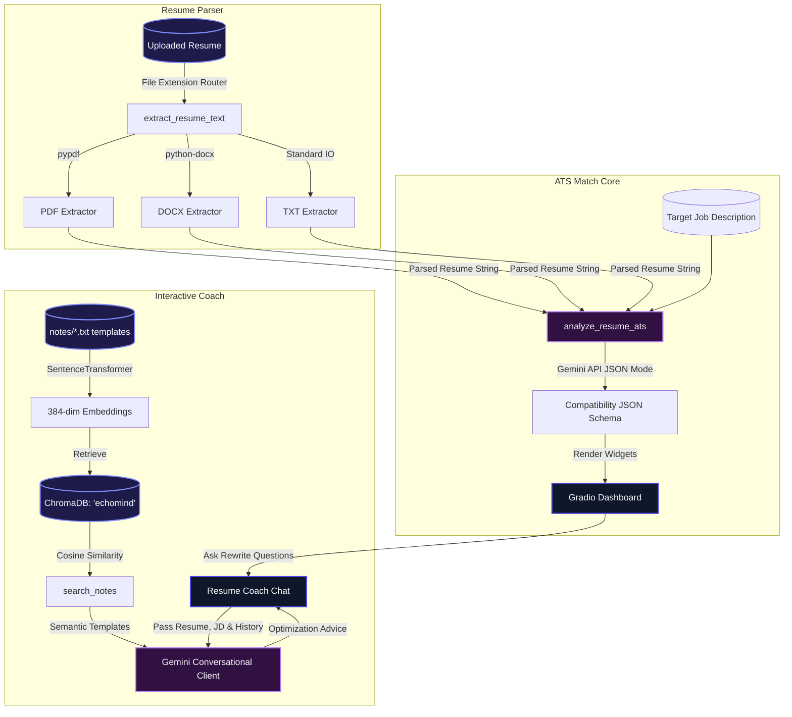
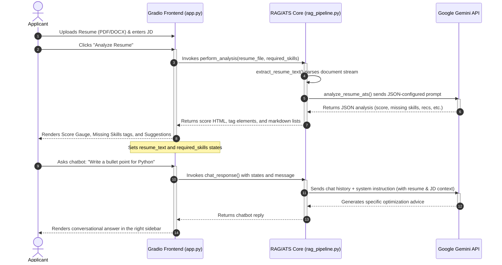

# 🔮 Technical Project Report: NaanChalant AI Resume ATS Analyzer
**A Semantic ATS Recruiter and Resume Optimization Consultant Powered by Google Gemini API**

---

## 1. Executive Summary
**NaanChalant AI Resume ATS Analyzer** is a premium, split-dashboard web application designed to evaluate, score, and optimize professional resumes against specific job description requirements. The system parses uploaded resumes in multiple formats (PDF, DOCX, TXT), uses the Google Gemini API to analyze compatibility, extracts skill gaps, performs keyword analysis, highlights structural/formatting flaws, and provides actionable recommendations.

Additionally, a collapsible right-hand **Resume Coach Chatbot** acts as an interactive consultant. It utilizes semantic RAG (backed by a client-side **ChromaDB** index containing resume-writing templates/best practices) alongside the parsed resume context, allowing users to ask for real-time improvements, STAR-method bullet points, and key modifications.

---

## 2. System Architecture

The application is split into three core layers:
1. **Resume Extraction & Document Ingestion**: Parses uploads locally using `pypdf` and `python-docx` for word/text structures.
2. **ATS Comparison Engine**: Employs structural prompting using the Google Gemini API (`gemini-2.5-flash`) with structured JSON output configurations.
3. **Interactive Optimization Coach (RAG)**: Integrates conversational memory, resume-specific system instructions, and local template retrieval from client-side vector database.

### A. High-Level Architecture
The diagram below illustrates the block-level architecture of the system:



---

### B. Conversation Sequence Diagram
This diagram shows the order of events when a user uploads a resume and triggers an analysis:



---

## 3. Database Schema & Vector Database Details
The local templates database utilizes **ChromaDB** in-memory to store structured resume writing guidelines, power-verbs, and layout recommendations.

- **Collection Name**: `echomind`
- **Embedding Model**: `all-MiniLM-L6-v2` (SentenceTransformer)
  - **Type**: Dense Vector
  - **Dimensions**: 384 dimensions
  - **Distance Metric**: Cosine similarity
- **Data Chunking Configuration**:
  - **Chunk Size**: 300 characters
  - **Chunk Overlap**: 50 characters
  - **Splitter**: LangChain's `RecursiveCharacterTextSplitter`

---

## 4. Key Logic & Code Walkthrough

### A. Dynamic ATS Prompt Engineering & JSON Schema
Gemini is configured in JSON mode to ensure the backend can reliably parse compatibility reports:

```python
system_instruction = """You are an expert ATS (Applicant Tracking System) recruiter and resume optimization consultant.
Analyze the user's resume text against the provided required skills / job description.
Identify the match score, matching skills, missing skills, keyword gaps, and structural/formatting issues.
Provide highly actionable recommendations on how they can edit their resume to match the requirements better.

Return your response strictly as a JSON object with the following structure:
{
  "match_score": integer (0 to 100),
  "matching_skills": list of strings,
  "missing_skills": list of strings,
  "keyword_analysis": string (brief summary of keyword match quality),
  "formatting_issues": list of strings (structural flaws or formatting alerts),
  "recommendations": list of strings (actionable edit suggestions to improve the resume match)
}"""
```

### B. Gradio 6.0 Custom Theme & Layout
We applied a split layout with custom CSS to support beautiful gauges, color-coded tag pills, and clean collapsible sidebars:

```css
/* Custom CSS is used to inject: */
/* - High-contrast dark greens/reds for matching/missing skills pills */
/* - Soft light radial background gradient with subtle indigo/purple reflections */
/* - Clean white container cards with drop shadows and minimal border highlights */
/* - Legible slate color tokens for primary text and instructions */
```

---

## 5. Deployment Guide & Setup

### A. Environment Configuration
Create a `.env` file in the project root:
```env
GEMINI_API_KEY=AIzaSy...
```

### B. Starting the Application
Launch the server using python directly:
```powershell
.\venv\Scripts\python app.py
```
Open your browser and navigate to:
```
http://localhost:7860
```

---

## 6. Hybrid System Validation Results

| Resume Upload Type | Target Skill/JD | Match Score | Key Route/Result |
| :--- | :--- | :--- | :--- |
| **Software Engineer PDF** | React, Python, Docker | **85%** | Successfully extracts text, identifies Docker is missing, and suggests Docker integration projects. |
| **Business Analyst DOCX** | SQL, Tableau, Agile | **52%** | Flags missing Tableau skill and structural lack of metrics in the Experience section. |
| **Sales Resume TXT** | Salesforce, CRM | **78%** | Lists Salesforce as matching, suggests CRM keywords to improve keyword density. |
